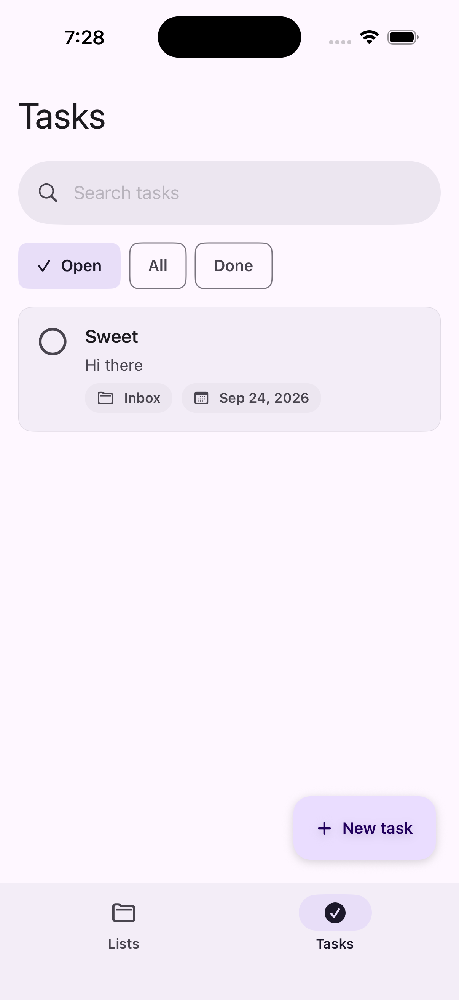

# OrganizeItAll

OrganizeItAll is a native iPhone and iPad task organizer built with **SwiftUI**, **SwiftData**, **Swift 6**, and a native **Material Design 3** design system.

## Feature support

| Area | Status |
| --- | --- |
| Task Lists | **Complete / Supported** |
| Inbox | **Complete / Supported** |
| Task CRUD and completion | **Complete / Supported** |
| Task organization and movement | **Complete / Supported** |
| Search, filtering, and sorting | **Complete / Supported** |
| Manual ordering and bulk actions | **Complete / Supported** |
| SwiftPM developer workflow | **Supported** |
| Xcode developer workflow | **Supported** |

**Task List support is complete for the current product scope.** Future additions should be treated as enhancements rather than missing baseline functionality.

## Screenshot



## Features

### Task Lists

- Permanent built-in **Inbox** for tasks that are not assigned to a custom list.
- Create, edit, and delete custom task lists.
- Search lists by name or notes.
- Active and Archived list scopes.
- Pin and unpin lists.
- Archive and restore lists.
- Customize list icon and Material color.
- Manually reorder custom lists.
- Prevent duplicate custom list names and reserve the name **Inbox**.
- Deleting a custom list preserves its tasks by returning them to Inbox.

### Tasks

- Create, edit, complete, reopen, and delete tasks.
- Move tasks between Inbox and custom lists.
- Low / Normal / High priority.
- Optional due dates and overdue indication.
- Search task titles and notes inside Inbox and custom lists.
- Filter by **Open / All / Completed**.
- Sort by **Smart / Manual / Due date / Priority / Recently updated / Created**.
- Manual drag ordering.
- Context-menu quick actions.
- Multi-select with bulk complete, reopen, move, and delete actions.

### Appearance

- Native SwiftUI Material Design 3 adaptation.
- Light and dark Material color schemes.
- SF Symbols for platform-native iconography.

## UI / design system

The interface uses an iOS-native Material Design 3 adaptation implemented directly in SwiftUI. There is no Android/Compose runtime and no third-party Material UI framework.

The design system includes:

- Material 3 semantic color roles and light/dark schemes
- Material type-scale tokens using the system font
- Material shape tokens
- container cards and surfaces
- extended floating action buttons
- filter chips
- filled text fields
- search bars
- Material-style bottom navigation
- tonal metadata and action surfaces
- SF Symbols for platform-native iconography

## Stack

- SwiftUI app lifecycle (`@main App`)
- SwiftData (`@Model`, `@Query`, `ModelContext`)
- Swift 6 language mode with complete concurrency checking
- iOS / iPadOS 17.0+
- Swift Testing
- Material Design 3-inspired SwiftUI design system
- SF Symbols
- Swift Package Manager developer tooling
- `swift-argument-parser` for the Swift CLI

## Project layout

```text
OrganizeItAll/
├── App/
├── DesignSystem/
├── Models/
├── Features/
│   ├── TaskLists/
│   └── Tasks/
└── Resources/

OrganizeItAllTests/

Sources/
└── OrganizeItAllCLI/            # native Swift developer CLI

Plugins/
└── OrganizeItAllAppCommandPlugin/ # `swift package app`

scripts/
├── menu.sh                      # optional shell/fzf workflow
├── launch.sh                    # optional simulator workflow
└── publish.sh                   # App Store export and upload

Package.swift
OrganizeItAll.xcodeproj/         # Xcode project and shared scheme
```

## Quick start

### Requirements

- macOS with full Xcode installed with Swift 6 support.
- An iOS simulator runtime installed through Xcode.
- An iPhone or iPad simulator running iOS 17 or later.

Swift Package Manager ships with the Swift toolchain. For this iOS project, use the Swift toolchain bundled with full Xcode rather than standalone Command Line Tools.

To make full Xcode the active developer directory:

```bash
sudo xcode-select --switch /Applications/Xcode.app/Contents/Developer
```

Clone the repository:

```bash
git clone https://github.com/moyarich/organizeitall.git
cd organizeitall
```

## SwiftPM workflow

SwiftPM is a first-class developer entry point for the repository.

```bash
swift build
swift test
swift run
```

`swift run` builds the `organizeitall` executable and, by default, builds and launches the iOS app on an available simulator.

Explicit CLI commands:

```bash
swift run organizeitall run
swift run organizeitall build
swift run organizeitall test
swift run organizeitall devices
swift run organizeitall stop
swift run organizeitall xcode
```

The package command plugin exposes the same native Swift tooling through:

```bash
swift package app run
swift package app build
swift package app test
swift package app devices
swift package app stop
swift package app xcode
```

Useful standard SwiftPM commands also include:

```bash
swift package describe
swift package show-dependencies
swift package clean
swift package reset
```

The SwiftPM executable and command plugin are implemented in Swift and do not delegate to `scripts/launch.sh`.

## Xcode workflow

Open `OrganizeItAll.xcodeproj`, select the **OrganizeItAll** scheme and an iPhone or iPad simulator, then press **Command-R**.

From the command line:

```bash
open OrganizeItAll.xcodeproj
```

Xcode remains the native project environment for SwiftUI development, debugging, signing, previews, simulator management, and App Store archives.

## Optional shell workflow

The existing shell launcher remains available as an optional workflow and is independent of the SwiftPM CLI.

Install `fzf` if you want interactive shell menus:

```bash
brew install fzf
```

Then run:

```bash
./scripts/menu.sh
```

Or use direct shell commands:

| Command | Action |
| --- | --- |
| `./scripts/launch.sh run` | Choose a simulator, build, and launch the app |
| `./scripts/launch.sh build` | Build for iOS Simulator without launching |
| `./scripts/launch.sh test` | Choose a simulator and run tests |
| `./scripts/launch.sh devices` | List available simulators and UUIDs |
| `./scripts/launch.sh stop` | Stop the app on booted simulators |
| `./scripts/launch.sh xcode` | Open the Xcode project |
| `./scripts/launch.sh help` | Show command usage |

## Tests

Run model and persistence tests with:

```bash
swift test
```

or:

```bash
./scripts/test.sh
```

The suite covers Inbox assignment, completion timestamps, smart and manual ordering, priority and due-date sorting, list relationships, list organization metadata, persistence, moving tasks, task deletion, open-task counts, and preserving tasks when a list is deleted.

For the Xcode/iOS test workflow:

```bash
swift run organizeitall test
```

## Persistence

`TaskList` and `TaskItem` are SwiftData models. `TaskList.tasks` uses a nullify relationship rule, so deleting a custom list preserves its tasks and returns them to Inbox.

Task Lists persist organization metadata including pin/archive state, icon, color, and manual order. Tasks persist their own manual order in addition to normal task metadata.

The old 2020 Core Data store is intentionally not part of the modern runtime. If importing historical user data ever becomes necessary, implement it as a bounded one-time migration tool instead of restoring Core Data as a permanent dependency.

## Publish to App Store Connect

Use `scripts/publish.sh` to archive a Release build and export or upload it with Xcode. This requires an Apple Developer Program membership, a registered bundle ID `com.moyarich.OrganizeItAll`, and a matching app record in App Store Connect.

On a fresh checkout, copy `.env.example` to `.env` and configure:

- `APPLE_TEAM_ID`
- `ASC_KEY_ID`
- `ASC_ISSUER_ID`
- `ASC_KEY_PATH`
- `APP_VERSION`
- `BUILD_NUMBER`

Then run:

```bash
./scripts/publish.sh check
./scripts/publish.sh export
./scripts/publish.sh upload
```

Uploading does not submit the app for review or release it publicly. Finish the App Store listing, screenshots, privacy/compliance information, build selection, and review submission in App Store Connect.

## Developer guide

See [Developer guide](docs/README-DEV.md) for architecture, Material 3 conventions, persistence rules, testing, SwiftPM, Xcode, and development commands.

## Close the app

From the native Swift CLI:

```bash
swift run organizeitall stop
```

Or with the optional shell workflow:

```bash
./scripts/launch.sh stop
```

This stops OrganizeItAll on booted simulators without deleting saved task data.
